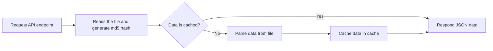
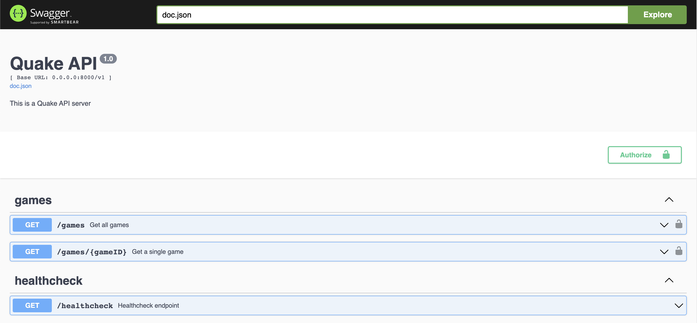
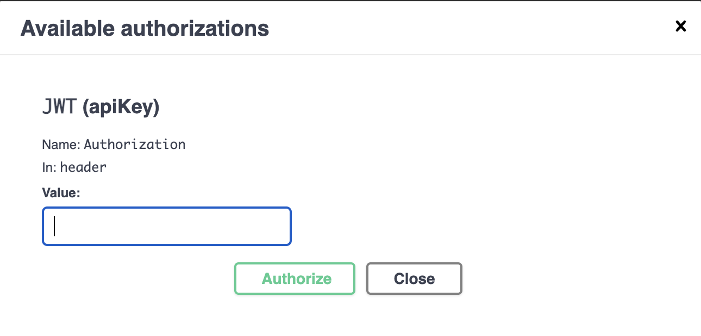
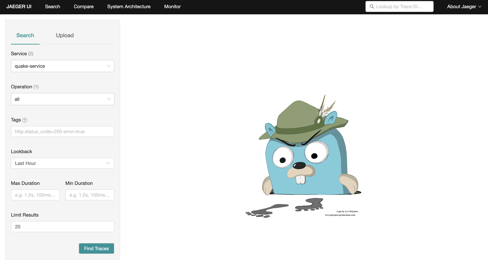
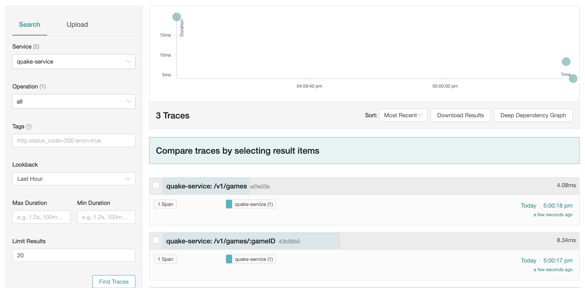
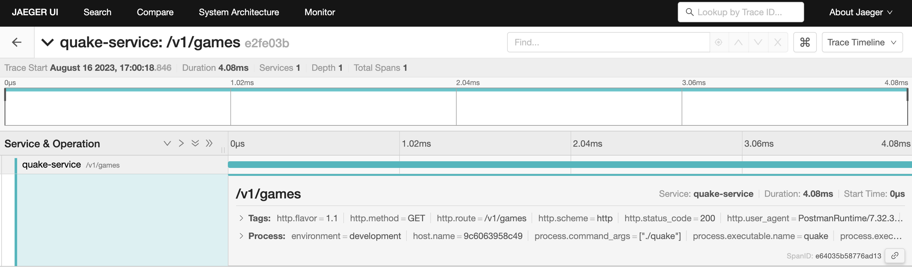

# Quake Log Parser

  

## Description

 Test is intended for candidates applying to Software Engineering positions at CloudWalk

## Technologies Used

* [Golang](https://go.dev/)
* [Gin](https://github.com/gin-gonic/gin)
* [Viper](https://github.com/spf13/viper)
* [Redis](https://redis.io/)
* [Prometheus](https://prometheus.io/)
* [Jaeger](https://www.jaegertracing.io/)
* [Docker](https://www.docker.com/)

## Project Structure

```
.
├── assets               # Static content used in README
├── cmd                  # API start entrypoint
├── config               # General configurations
├── docs                 # Swagger documentation
├── domain               # All the domain related logic
├──── entity             # Domain business rules
├──── usecase            # Application rules
├── infra                # Capabilities for 3rd-party libraries
├──── api                # API configurations
├────── controller       # Endpoint configurations
├────── middleware       # Middlewares to support some external logic
├────── presenter        # JSON response formatter
├──── repository         # Logic to deal with external components
├──── tracing            # Logic to deal with tracing and monitoring
├────── config           # General tracing configurations
├── .env                 # Local configuration file
├── docker-compose.yaml  # Docker compose configuration
├── Dockerfile           # Docker container configuration
├── go.mod               # Dependency control file
├── go.sum               # Dependencies Integrity File
├── main.go              # Project start entrypoint
├── Makefile             # Process automation script
├── postman              # Postman collection
└── README.md            # Doc for general instructions
```

## How It Works

The API reads a file located at the root of the project, analyzes the lines, puts it in a Redis and at each execution it validates if the file has already been cached




## Getting Started

### Build Local

```
make build
```

### Run Local

:warning: When running locally, it will not use redis and will not automatically generate metrics

```
make run
```

### Build for Docker

```
make docker-build
```

### Run in Docker

```
make docker-run
```

### Run Unit Tests

```
make test
```

### View Coverage Report

```
make coverage
```

## Configuration

| Variable                     | Default Value                   | Type    |
| ---------------------------- | ------------------------------- | ------- |
| SERVICE_NAME                 | quake-service                   | string  |
| ENVIRONMENT                  | development                     | string  |
| FILE_NAME                    | log.txt                         | string  |
| SERVER_ADDRESS               | 0.0.0.0                         | string  |
| SERVER_PORT                  | 8000                            | integer |
| REDIS_ADDRESS                | 0.0.0.0                         | string  |
| REDIS_PORT                   | 6379                            | integer |
| REDIS_DB                     | 0                               | integer |
| GIN_MODE                     | release                         | string  |
| API_SECRET                   | quake                           | string  |
| API_AUTH_SKIP_ROUTES         | /v1/healthcheck                 | array   |
| OPEN_TELEMETRY_COLLECTOR_URL | http://0.0.0.0:14278/api/traces | string  |

## Security

The API uses JWT as the authentication mechanism passing through the Authorization header
You can use the env API_SECRET to generate a new token in https://jwt.io

## Usage

There is a Postman collection located in the [postman](./postman/) folder. Just import it and request the API endpoints

## Documentation

You can access the swagger documentation through the URL `http://0.0.0.0:8000/docs/index.html`



You will need to authorize yourself to execute the requests



## View Metrics

When running in docker, you can see the Jeager metrics through the URL `http://0.0.0.0:16686/search`



Find for traces



Explore details

